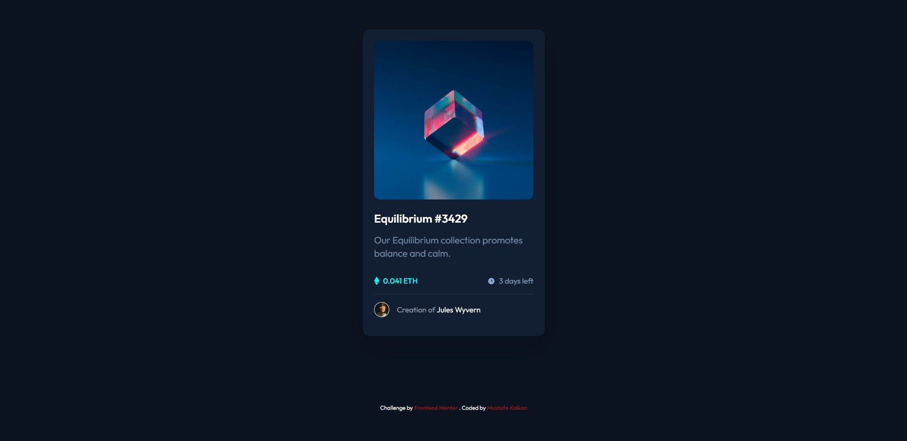

# Frontend Mentor - NFT preview card component solution

This project is a simple web application of NFT preview card component solution. The project was developed using HTML and TailwindCSS and published using GitHub Pages.

Front End Mentor - NFT preview card component solution. This is a solution to the Product preview card component problem in Frontend Mentor. Frontend Mentor challenges help you improve your coding skills by creating realistic projects.

Contents

- [Project URL](#project-urls)
- [Features](#features)
- [Project Content](#project-content)
- [Screenshot](#screenshot)
- [Challenge](#challenge)
- [Technologies-Used](#Technologies-Used)
- [Author](#author)
- [License](#license)
- [Show-Your-Support](#show-your-support)

# Project URL

The project is published at: [Four card Feature section master](https://mkalkandev.github.io/NFT-preview-card-component/)

# Features

- **Responsive Design:** Provides a good user experience on mobile devices.
- **Simple and User Friendly Interface:** Provides easy access to recipe information.

- **Modern HTML and CSS Techniques:** Clean and maintainable code structure.

# Project Content

This project contains the following files and folders:

- **index.html:** HTML file for the home page.

- **/src/input.css:** and **/src/output.css:** CSS file that creates the design of the project.

- **images/**: Folder containing images used on the page.

# Screenshot

# Challenge

My app allows users to:

Display the optimal layout for the app based on their device's screen size
See the navigation states for all interactive elements on the page
ongoing development
This was my third project involving HTML and TailwindCSS and I'm happy with the result. I tried to use Tailwindcss more effectively.

I plan to continue exploring and learning more about this technology, so there will definitely be more projects related to it in the future.

# Technologies Used

Operating System

Initial phase

tools

# Author

👤MustafaKalkan

Github:<a href="https://github.com/mkalkandev/" target="_blank">@mkalkandev</a>

Front End Mentor:<a href="https://www.frontendmentor.io/profile/mkalkandev" target="_blank">@mkalkandev</a>

# License

📝 Copyright © 2025 MustafaKalkan.

This project is licensed by [MIT](./LICENSE).

# Show your support

If you found this project useful, give it a ⭐️! Have fun building it! 🚀
